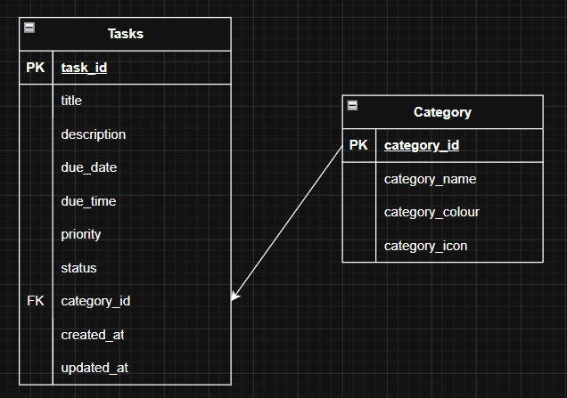

# Entity Relationship Diagram (ERD)

## Diagram

## Relationship

- One Category can have many Tasks.
- Each Task belongs to one Category.
- `Tasks.category_id` is a foreign key that references `Category.category_id`.

## Cardinality

Category (1) --------< (Many) Tasks